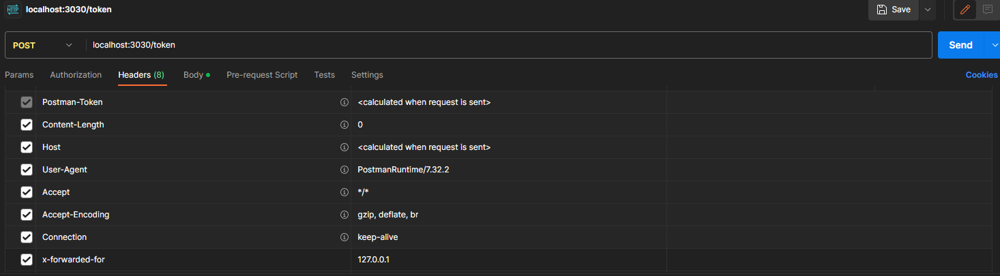
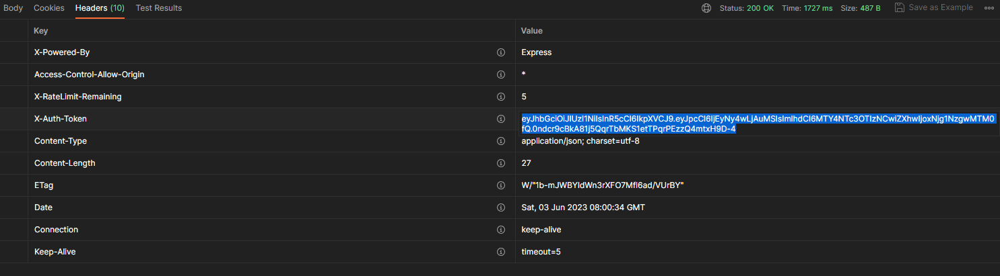
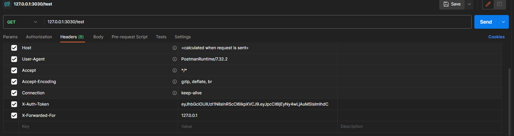
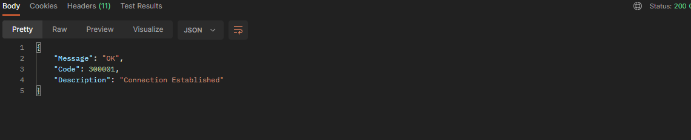
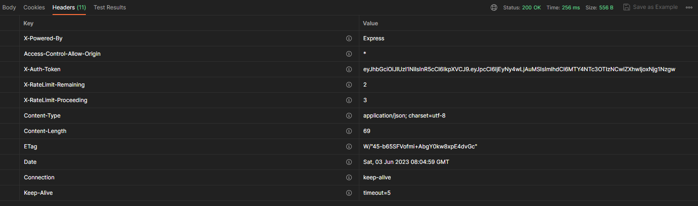
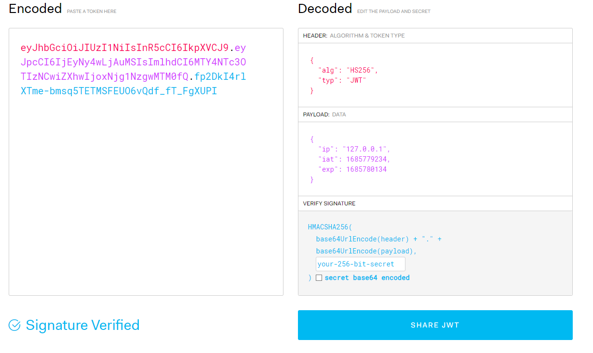
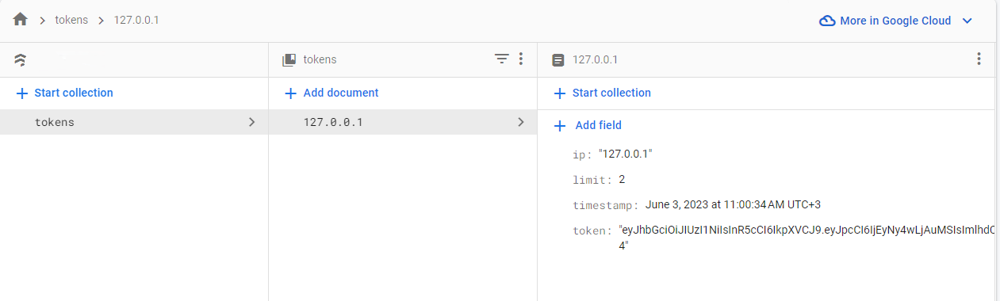

# 🔑 Node.js Token Middleware

This repository provides a middleware structure for Node.js to create and manage JWT-based tokens per IP address. It includes token creation, validation, rate limiting, and logging into Firebase Firestore. 🚀

## 📌 Overview

This middleware:

- 🌐 Generates JWT tokens based on IP addresses.
- ⚙️ Limits tokens to a configurable usage limit within a time frame.
- 📂 Stores token details in Firebase Firestore.
- 🎯 Supports both header-based (`X-Forwarded-For`) and automatic IP detection (`request.socket.remoteAddress`).

## 📥 Installation

Clone the repository and install dependencies:

```sh
git clone https://github.com/yourusername/token-middleware.git
cd token-middleware
npm install
```

## 🛠️ Configuration

Create a `.env` file based on the `.env_SCHEME` provided:

```env
JWT_SECRET=your_jwt_secret
RATE_LIMIT=5
RATE_LIMIT_WINDOW=15 # in minutes
PATH_TO_SERVICE_ACCOUNT=your_service_account.json
```

Download your Firebase service account JSON file from Firebase Console and place it in the root directory. Update the `.env` file accordingly.

## 🚦 Usage

### 📌 Creating Tokens

- **Endpoint**: `/token`
- **Method**: POST

Send the IP address either via:

- `X-Forwarded-For` header (optional)
- or rely on automatic detection via `request.socket.remoteAddress`.


**Response Headers**:

- 🔑 `X-Auth-Token`: JWT token generated.
- 📊 `X-RateLimit-Remaining`: Remaining usage limit.




### 🚀 Sending Requests with Token

When accessing other API endpoints, you must include:

- 🔑 `X-Auth-Token`: Token received during creation.
- 🌐 IP address (optional) via `X-Forwarded-For` header or automatically detected.

**Example Request Header**:

```http
GET /test
X-Auth-Token: <your_jwt_token>
X-Forwarded-For: 127.0.0.1
```



### 📬 API Response

Responses will include headers:

- 🔑 `X-Auth-Token`: Token echoed back for reference.
- 📈 `X-RateLimit-Proceeding`: Number of requests made.
- 📊 `X-RateLimit-Remaining`: Remaining usage.




### 📄 JWT Token Structure

Tokens generated are JWTs, structured as follows:

```json
{
  "ip": "127.0.0.1",
  "iat": 1685779234,
  "exp": 1685780134
}
```



## 🔥 Firebase Firestore Structure

Token details are stored in Firestore:



## 📖 Swagger UI

Swagger UI documentation is available at:

```
http://localhost:<port>/api-docs
```


## ⚠️ Important Notes

- 🔑 JWT secret and limits are configurable in the `.env` file.
- 📌 Tokens are limited to 5 requests per 15 minutes by default.
- ⚙️ Adjust configurations according to your requirements.

## 🤝 Contributing

Contributions are welcome. Open issues or pull requests for any improvements or fixes.

## 📃 License

Distributed under the MIT License. See `LICENSE` for more details.

